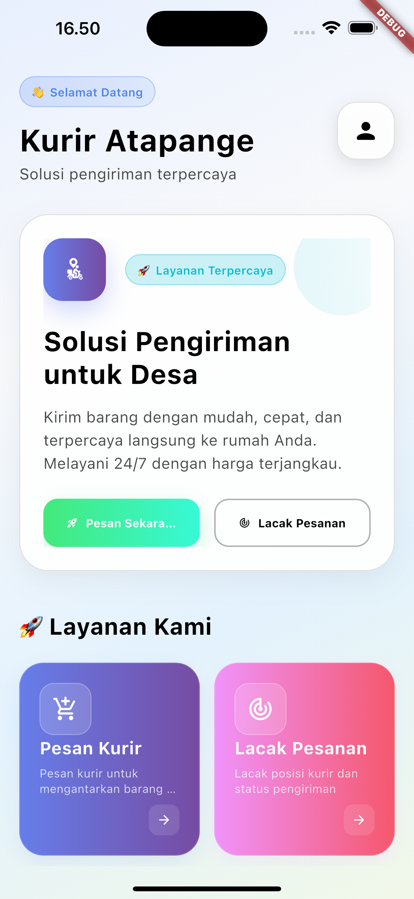
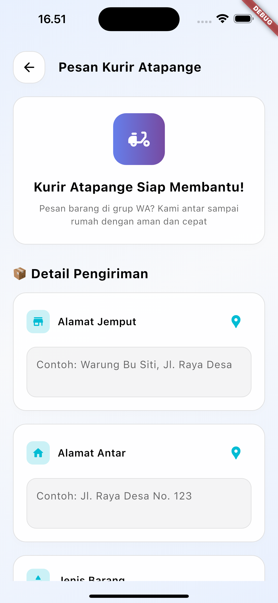
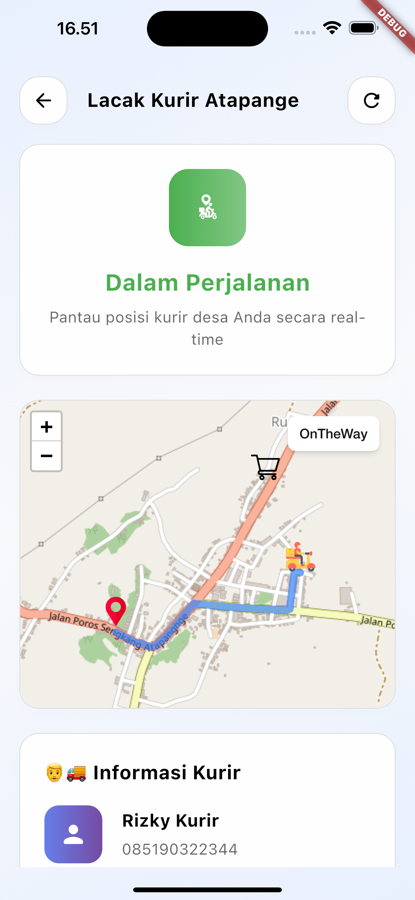

# My Kurir App 📦

Aplikasi kurir berbasis Flutter dengan integrasi Firebase untuk mengelola layanan pengiriman, tracking real-time, dan manajemen order.

## 📱 Tentang Aplikasi

My Kurir App adalah aplikasi mobile yang dirancang khusus untuk:
- **Kurir**: Mengelola pesanan, tracking lokasi, dan update status pengiriman
- **Pelanggan**: Membuat order, tracking paket, dan melihat riwayat pengiriman
- **Admin**: Monitoring sistem dan manajemen kurir

## ✨ Fitur Utama

- 🔐 **Autentikasi** - Login/Register dengan Firebase Auth
- 📦 **Manajemen Order** - Buat, kelola, dan tracking pesanan
- 🚚 **Kurir Management** - Sistem kurir dengan profil dan rating
- 📍 **Real-time Tracking** - Lacak posisi kurir dan status pengiriman
- 💰 **Sistem Tarif** - Kalkulasi biaya berdasarkan jarak dan layanan
- 📊 **History & Reports** - Riwayat transaksi dan laporan
- 👤 **Profile Management** - Kelola profil pengguna
- 🎨 **Dark/Light Theme** - Tema yang dapat disesuaikan
- 📱 **Onboarding** - Panduan untuk pengguna baru

## 🛠️ Teknologi yang Digunakan

- **Framework**: Flutter
- **Bahasa**: Dart
- **Backend**: Firebase (Auth, Firestore, Cloud Messaging)
- **State Management**: Provider/ChangeNotifier
- **Routing**: Go Router (app_router.dart)
- **Platform**: iOS & Android

## 📋 Prasyarat

- [Flutter SDK](https://flutter.dev/docs/get-started/install) (versi 3.0+)
- [Dart SDK](https://dart.dev/get-dart)
- [Android Studio](https://developer.android.com/studio) atau [VS Code](https://code.visualstudio.com/)
- [Xcode](https://developer.apple.com/xcode/) (untuk iOS development)
- Akun [Firebase](https://console.firebase.google.com/)

## 🚀 Instalasi dan Setup

### 1. Clone Repository
```bash
git clone https://github.com/username/my_kurir_app.git
cd my_kurir_app
```

### 2. Install Dependencies
```bash
flutter pub get
```

### 3. Firebase Setup
Project sudah dikonfigurasi dengan Firebase. File konfigurasi sudah tersedia:
- `android/app/google-services.json` - Konfigurasi Android
- `ios/Runner/GoogleService-Info.plist` - Konfigurasi iOS
- `lib/firebase_options.dart` - Generated Firebase options

### 4. Jalankan Aplikasi
```bash
# Debug mode
flutter run

# Pilih device spesifik
flutter run -d <device_id>

# Release mode
flutter run --release
```

## 📱 Build untuk Production

### Android
```bash
# Build APK
flutter build apk --release

# Build App Bundle (recommended untuk Play Store)
flutter build appbundle --release
```

### iOS
```bash
# Build untuk iOS
flutter build ios --release
```

## 🏗️ Struktur Project

```
lib/
├── main.dart                    # Entry point aplikasi
├── firebase_options.dart        # Firebase configuration
├── data/
│   └── onboarding_data.dart    # Data untuk onboarding
├── models/                     # Data models
│   ├── user_model.dart
│   ├── kurir_model.dart
│   ├── order_model.dart
│   ├── tariff_model.dart
│   └── info_layanan.dart
├── pages/                      # UI Screens
│   ├── auth/                   # Authentication pages
│   ├── home/                   # Home dashboard
│   ├── order/                  # Order management
│   ├── kurir/                  # Kurir management
│   ├── tracking/               # Real-time tracking
│   ├── history/                # Transaction history
│   ├── profile/                # User profile
│   ├── onboarding/             # App introduction
│   └── splashscreen/           # Loading screen
├── routes/                     # Navigation
│   ├── app_router.dart         # Route definitions
│   └── route_logger.dart       # Route logging
├── util/                       # Utilities
│   ├── session_manager.dart    # Session management
│   ├── theme_notifier.dart     # Theme management
│   ├── utility.dart            # Helper functions
│   └── performace_util.dart    # Performance monitoring
└── widgets/                    # Reusable widgets
    ├── common/                 # Common widgets
    ├── order/                  # Order-specific widgets
    ├── tracking/               # Tracking widgets
    ├── glass_container.dart    # Glass morphism effect
    └── simple_card.dart        # Card components
```

## 🔧 Konfigurasi

### Firebase Services
Aplikasi menggunakan layanan Firebase berikut:
- **Authentication** - Login/Register
- **Firestore** - Database real-time
- **Cloud Messaging** - Push notifications
- **Performance Monitoring** - App performance tracking

### Theme Configuration
Aplikasi mendukung dark/light theme yang dikelola melalui `ThemeNotifier`.

## 🧪 Testing

```bash
# Run unit tests
flutter test

# Run dengan coverage
flutter test --coverage

# Analyze code
flutter analyze
```

## 📱 Screenshots

<!-- Tambahkan screenshots aplikasi di sini -->
| Onboarding | Home | Order | Tracking |
|------------|------|-------|----------|
|  |  |  |  |

## 🚀 Deployment

### Android (Google Play Store)
1. Build app bundle: `flutter build appbundle --release`
2. Upload ke Google Play Console
3. Ikuti proses review Google Play

### iOS (App Store)
1. Build iOS: `flutter build ios --release`
2. Archive di Xcode
3. Upload ke App Store Connect

## 🤝 Kontribusi

1. Fork repository
2. Buat feature branch (`git checkout -b feature/amazing-feature`)
3. Commit changes (`git commit -m 'Add amazing feature'`)
4. Push ke branch (`git push origin feature/amazing-feature`)
5. Buat Pull Request

## 📝 Changelog

### v1.0.0 (Current)
- ✅ Sistem autentikasi Firebase
- ✅ Manajemen order dan kurir
- ✅ Real-time tracking
- ✅ Sistem tarif dinamis
- ✅ Dark/Light theme
- ✅ Onboarding flow

## 🐛 Known Issues

- [ ] Performance optimization untuk large datasets
- [ ] Offline mode support
- [ ] Push notification improvements

## 📞 Support

- 📧 Email: support@mykurirapp.com
- 🐛 Issues: [GitHub Issues](https://github.com/username/my_kurir_app/issues)
- 📖 Documentation: [Wiki](https://github.com/username/my_kurir_app/wiki)

## 📄 License

This project is licensed under the MIT License - see the [LICENSE](LICENSE) file for details.

---

**Dibuat dengan ❤️ menggunakan Flutter**

⭐ Star repository ini jika membantu!
